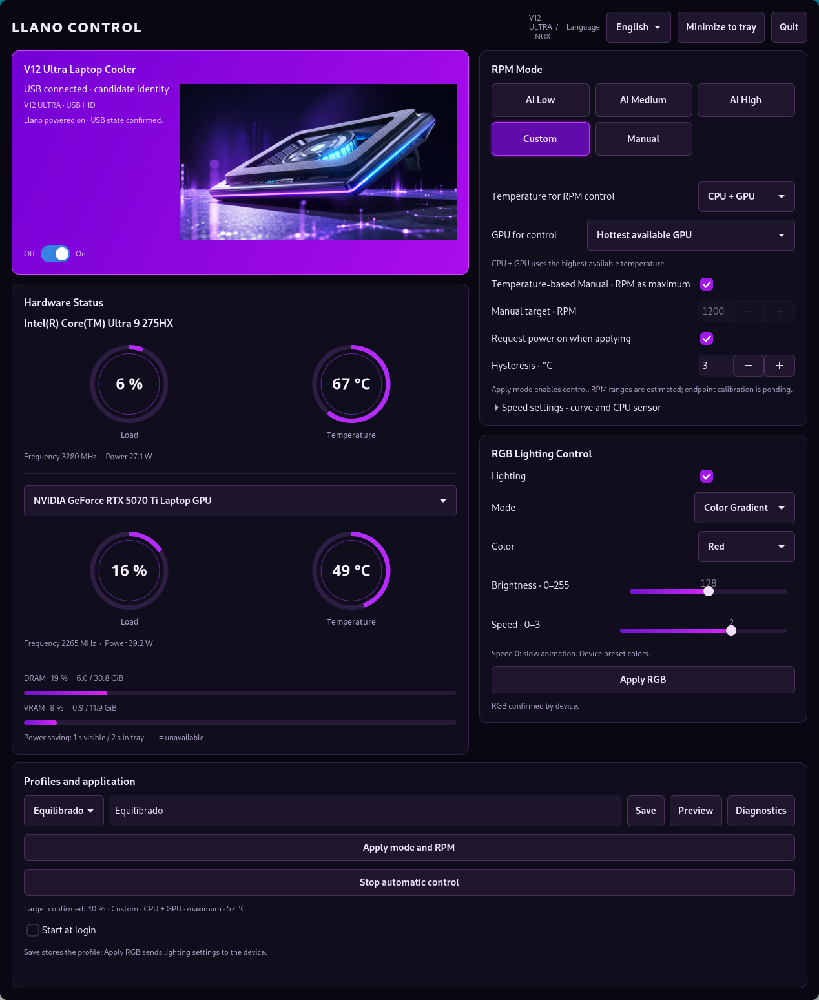
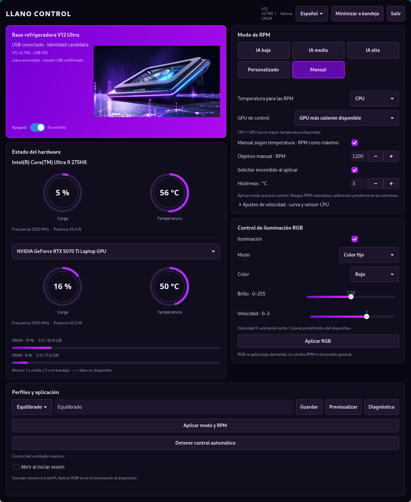

# Llano Control

Native GTK4 application for the **Llano V12 Ultra** on Linux, developed on PikaOS with Hyprland. Monitor CPU/GPU temperatures, control lighting, and run temperature-based fan profiles from the window or system tray.

[Español](README.es.md) · [Protocol evidence](docs/PROTOCOL.md) · [Contributing](CONTRIBUTING.md)

**Version 0.8.4 — experimental hardware support.** HID messages are based on captures from MythCool on Windows. Automated tests check the captured bytes and state handling; physical Linux validation and calibration at the lowest/highest RPM targets remain incomplete. Displayed RPM targets are estimates, not tachometer readings. This is an independent project, not official Llano software.

**[Download v0.8.2](https://github.com/tal0nmallorca/llano-control/releases/tag/v0.8.2)** · Save settings on close and apply RPM/RGB on startup.

## Screenshots

Actual application captures on Hyprland with live CPU and NVIDIA GeForce RTX 5070 Ti Laptop GPU telemetry: load, temperature, frequency, power and VRAM. Unavailable readings appear as “—”.

| English | Español |
| --- | --- |
| [](docs/screenshots/llano-control-nvidia-en.png) | [](docs/screenshots/llano-control-nvidia-es.png) |

Click either image to view it at full size.

## Features

- RGB power, four effects, five preset colors, brightness 0–255 and animation speed 0–3.
- Device power switch with remembered position and USB state confirmation.
- Fixed or temperature-based Manual, AI Low/Medium/High and Custom fan curves.
- CPU, a selected GPU, or the highest available CPU/GPU temperature as the control source.
- Intel/AMD CPU and Intel/NVIDIA/AMD GPU monitoring where the driver exposes readings.
- Spanish and English, switched immediately without restarting.
- Startup minimized, tray integration and optional login autostart.
- Sensor sampling every 1 s visible / 2 s hidden; reduced work in the tray. Suspended NVIDIA GPUs are not queried.

| Mode | Estimated RPM target range |
| --- | --- |
| AI Low | 300–1000 |
| AI Medium | 600–2000 |
| AI High | 1000–2800 |
| Manual | Fixed target, or 300 up to the selected maximum |
| Custom | User-defined curve, 300–2800 |

AI curves rise linearly from 30 to 90 °C. Targets use 100 RPM steps. The observed middle-range calibration is 40% → 1300 RPM, 50% → 1550 RPM and 60% → 1800 RPM. The remaining range is an experimental extrapolation.

## Install on PikaOS / Debian / Ubuntu

Python 3.10+ and system GTK bindings are required. There is no compilation step and no pip runtime dependency.

```sh
sudo apt install python3 python3-gi python3-cairo python3-gi-cairo \
  gir1.2-gtk-4.0 gir1.2-gtk-3.0 gir1.2-ayatanaappindicator3-0.1
```

Download or clone this repository, then run from its directory:

```sh
python3 install.py
~/.local/bin/llano-control gui
```

The installer writes to `~/.local/share/llano-control`, creates a launcher in `~/.local/bin` and adds a desktop entry. It preserves profiles and does not enable autostart or apply hardware settings. Install updates by running it again. Other distributions need equivalent GTK/PyGObject/Cairo packages.

A StatusNotifier/AppIndicator tray host is needed for minimized operation. On Hyprland, enable the `tray` module in Waybar. If no tray is available, the app opens its window. NVIDIA telemetry optionally uses `nvidia-smi` from the installed driver.

### Device access

The supported identity is USB `374a:b101` with a matching HID report descriptor. Connect both the cooler's power supply and USB data cable. Verify the identity using:

```sh
./llano-control probe
```

For that device, install the specific udev rule once:

```sh
sudo install -m 0644 packaging/70-llano-control.rules.example /etc/udev/rules.d/70-llano-control.rules
sudo udevadm control --reload-rules
```

Disconnect and reconnect the USB data cable. The rule grants the active local session access to this device. Run the GUI as your ordinary user.

## Use

1. Close MythCool or another controller before applying settings.
2. Select the temperature source and GPU, then choose a mode. Click **Apply mode and RPM** to activate a snapshot of the current profile.
3. For combined CPU/GPU control, the highest available temperature is used. If one source is missing, the remaining source is identified in the status. GPU-only control pauses if its selected source is unavailable.
4. **Apply RGB** changes lighting while preserving fan/power settings. **Save** stores a profile without applying it immediately. Current edits are also saved automatically when hiding to the tray or exiting; unchanged settings are not rewritten.
5. The power switch controls fan, lights and display. It pauses the local fan curve; click Apply mode to resume it after powering on.
6. Enable **Start at login** if desired. On startup the saved RPM profile is applied after the first sensor sample, followed by RGB once the USB operation finishes. The saved profile controls whether power is requested. Loading a different profile while running still requires Apply.

Active fan control runs at most once every five seconds, including in the tray, and avoids rewriting unchanged targets. Using the physical knob, powering off, losing the required temperature or encountering a USB error pauses control without repeated retries. Stop automatic control leaves the last speed in place.

Profiles, language and last confirmed switch position are stored under `~/.config/llano-control/` (`XDG_CONFIG_HOME` supported). The embedded product illustration does not require a network request or a separate image file; see [NOTICE](NOTICE.md) for its provenance.

## Development and diagnostics

```sh
sudo apt install python3-yaml
python3 -m unittest discover -s tests -v
python3 -m compileall -q llano_control
./llano-control telemetry
```

The test suite currently contains **127 tests** and does not issue real USB commands. Minimal HID event fixtures are included; raw captures, machine logs and bottle backups are not.

`tools/capture-mythcool.py` and `tools/analyze-mythcool.py` use `tshark`/`dumpcap` and Linux usbmon for device-filtered captures. See [capture notes](docs/CAPTURE.md). The optional Soda/Bottles helper requires PyYAML and backs up a bottle before changing its runner; it is an experimental diagnostic, not an application dependency.

## License

Source code is licensed under [MIT](LICENSE). The embedded product artwork and Llano/MythCool names are excluded from that license; see [NOTICE](NOTICE.md).
